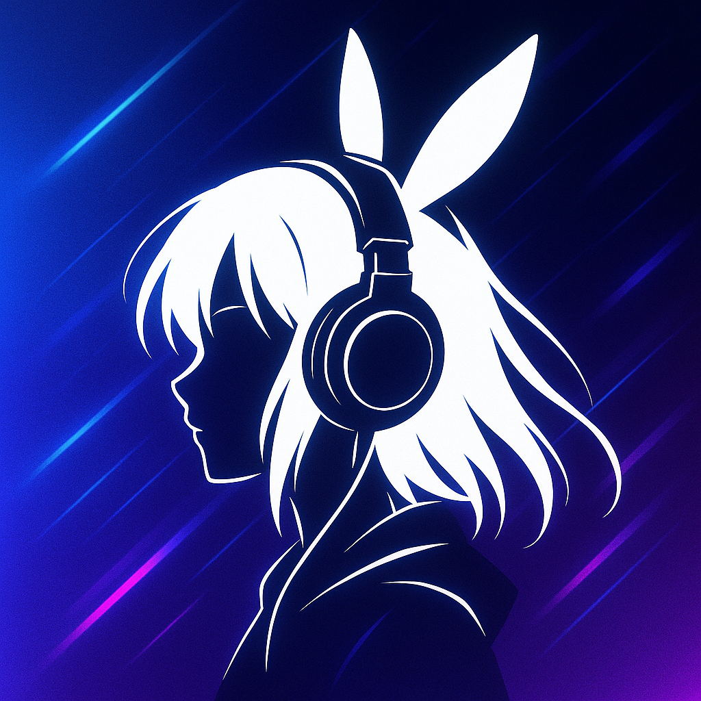

<p align="center">
  
</p>

# NightCore Player 倍速再生

[](https://apps.apple.com/jp/app/id6761187661)
[](https://github.com/MizuRyu/NightCorePlayer/tags)

Apple Music の楽曲を、好きなテンポで。ダウンロード不要で Nightcore スタイル（高速・高ピッチ）の再生ができる iOS アプリ。

**[App Store でダウンロード](https://apps.apple.com/jp/app/id6761187661)**

## 特徴

- **Apple Music の全曲が対象** — 端末にダウンロードした曲だけでなく、カタログ 1 億曲以上をそのまま速度変更して再生できる
- **0.5x〜3.0x のリアルタイム速度調整** — 再生中にスライダーで倍率を変えられる。0.01 刻みの微調整にも対応
- **検索・プレイリスト・キュー・履歴** — Apple Music のカタログ検索、プレイリスト再生、キュー編集、再生履歴の記録
- **等速再生は無料・無制限** — 倍速再生には 1 日の無料枠があり、動画広告で追加するか、買い切りの Pro で無制限にできる

[Nightcore とは](https://ja.wikipedia.org/wiki/%E3%83%8A%E3%82%A4%E3%83%88%E3%82%B3%E3%82%A2)

## 動作環境

iOS 17.0 以降の iPhone。再生には Apple Music のサブスクリプションが必要です。

## インストール

[App Store](https://apps.apple.com/jp/app/id6761187661) からインストールしてください。ソースからビルドする場合は下記「Build On Real Device」を参照。

## Tech Stack

| 項目 | 技術 |
|------|------|
| 言語 | Swift |
| UI | SwiftUI |
| 最小 OS | iOS 17.0 |
| 音楽 API | MusicKit / MediaPlayer |
| 永続化 | SwiftData |
| 課金 | StoreKit 2（非消耗型） |
| アーキテクチャ | MVVM + Service Layer（Protocol-based DI） |
| テスト | Swift Testing / XCTest（デモ録画用 UI テスト） |
| 品質ゲート | SwiftLint / SwiftFormat / lefthook |

## Directory Structure

```
Night-Core-Player/          # アプリ本体
├── Core/                   # エラー型、定数
├── Models/                 # 共有データ型
├── Services/               # ビジネスロジック + 外部接続
├── Data/                   # SwiftData 永続化
├── Features/               # 機能単位の View + ViewModel（Allowance 含む）
├── Extensions/             # 型拡張
└── Share/                  # 共有 UI コンポーネント

Night-Core-PlayerTests/     # ユニットテスト
Night-Core-PlayerUITests/   # デモ録画専用の UI テスト
scripts/                    # デモ録画・カタログ生成・スクリーンショット生成
docs/specs/                 # 仕様書
docs/adr/                   # Architecture Decision Record
```

詳細は [docs/specs/PROJECT-STRUCTURE.md](docs/specs/PROJECT-STRUCTURE.md) を参照。

## Documentation

| ドキュメント | 内容 |
|-------------|------|
| [ARCHITECTURE.md](docs/specs/ARCHITECTURE.md) | アーキテクチャ・設計ルール |
| [TESTING-STRATEGY.md](docs/specs/TESTING-STRATEGY.md) | テスト方針・Mock 規約 |
| [PROJECT-RULES.md](docs/specs/PROJECT-RULES.md) | 運用ルール |
| [PROJECT-STRUCTURE.md](docs/specs/PROJECT-STRUCTURE.md) | ディレクトリ構造 |
| [RELEASE.md](docs/specs/RELEASE.md) | TestFlight 配布・審査提出の手順 |
| [APP-REVIEW-NOTES.md](docs/specs/APP-REVIEW-NOTES.md) | 審査へ提出する説明文と根拠 |
| [docs/adr/](docs/adr/) | 設計判断の記録（ADR） |
| [docs/conventions/pr-assets.md](docs/conventions/pr-assets.md) | PR 成果物（スクショ・デモ動画）の置き場 |

## Development Workflow

初回のみ:

```sh
lefthook install
```

```sh
make check   # build + lint + swiftformat-lint
make build   # デバッグビルド
make lint    # SwiftLint
make test    # ユニットテスト（デモ用 UI テストは -skip-testing で除外）
make format  # SwiftFormat で自動整形
```

- pre-commit（lefthook）: 変更ファイルに対して `swiftlint lint --strict` + `gitleaks protect --staged`
- commit-msg（lefthook）: Conventional Commits 形式を強制
- SwiftFormat のインストール: `brew install swiftformat`（バージョンは `.swiftformat-version` を参照。不一致時は `make check` / `make format` が失敗する）
- UI に変更がある PR は `scripts/record-demo.sh` でデモ GIF / mp4 / スクショを生成し、`docs/conventions/pr-assets.md` の手順で `pr-assets` ブランチへ添付する

## Legal Pages

GitHub Pages で利用規約・プライバシーポリシーを公開できるように、`privacy-policy/` 配下に MkDocs サイトを置いている。

- 設定: `privacy-policy/mkdocs.yml`
- markdown 原稿: `privacy-policy/docs/`
- デプロイ workflow: `.github/workflows/pages.yml`

ローカル確認:

```sh
pip install mkdocs
mkdocs serve --config-file privacy-policy/mkdocs.yml
```

初回のみ、GitHub リポジトリの `Settings > Pages` で `Source` を `GitHub Actions` に設定する。

公開 URL:

- https://mizuryu.github.io/NightCorePlayer/
- https://mizuryu.github.io/NightCorePlayer/terms/
- https://mizuryu.github.io/NightCorePlayer/privacy/
- https://mizuryu.github.io/NightCorePlayer/support/

## Build On Real Device

接続中の iPhone を使って、VS Code のターミナルからビルド、インストール、起動できます。

### Prerequisites

- iPhone が Mac に接続されていること
- iPhone がアンロックされていること
- iPhone 側で「このコンピュータを信頼」を許可していること
- iPhone 側で Developer Mode を有効化していること
- 初回のみ、必要なら Xcode で `Signing & Capabilities` の署名設定を確認すること

### 1. Connected Device ID を確認

```sh
xcodebuild -showdestinations \
  -project Night-Core-Player.xcodeproj \
  -scheme Night-Core-Player
```

または:

```sh
xcrun xctrace list devices
```

出力された実機の `id` を控える。

### 2. Build

`<DEVICE_ID>` は実機の id に置き換える。

```sh
xcodebuild \
  -project Night-Core-Player.xcodeproj \
  -scheme Night-Core-Player \
  -configuration Debug \
  -destination 'id=<DEVICE_ID>' \
  -derivedDataPath ./.derivedData \
  -allowProvisioningUpdates \
  build
```

### 3. Install To Device

```sh
xcrun devicectl device install app \
  --device <DEVICE_ID> \
  ./.derivedData/Build/Products/Debug-iphoneos/Night-Core-Player.app
```

### 4. Launch

Bundle identifier は `MizuRyu.Night-Core-Player`。

```sh
xcrun devicectl device process launch \
  --device <DEVICE_ID> \
  MizuRyu.Night-Core-Player
```

コンソール付きで起動したい場合:

```sh
xcrun devicectl device process launch \
  --device <DEVICE_ID> \
  --console \
  MizuRyu.Night-Core-Player
```

## App Store Screenshots

App Store 用のスクリーンショットは、デバッグ専用のショーケース画面を `simctl` で起動して一括生成できる。

実行:

```sh
chmod +x scripts/capture_app_store_screenshots.sh
./scripts/capture_app_store_screenshots.sh
```

出力先:

```sh
build/app-store-screenshots/ja/
```

デフォルトでは `player` / `search` / `playlist` / `queue` を `iPhone 16 Pro Max` と `iPhone 16 Plus` で撮影する。必要なら環境変数で上書きする。

```sh
SCREENSHOT_DEVICES='iPhone 16 Pro Max|iPhone 16 Plus|iPhone SE (3rd generation)' \
SCREENSHOT_SCENES='player,search,playlist,queue' \
./scripts/capture_app_store_screenshots.sh
```

アプリは `-app-store-screenshot-scene <scene>` 起動引数を受け取る。今のところ利用できる scene は `player`, `search`, `playlist`, `queue`。

### Notes

- 接続デバイスが `Connecting` のままなら、ケーブル、信頼許可、Developer Mode を確認する
- 署名エラーが出る場合は、Xcode で一度プロジェクトを開いて team / signing を確認する
- このリポジトリは `Automatic Signing` を前提にしている
